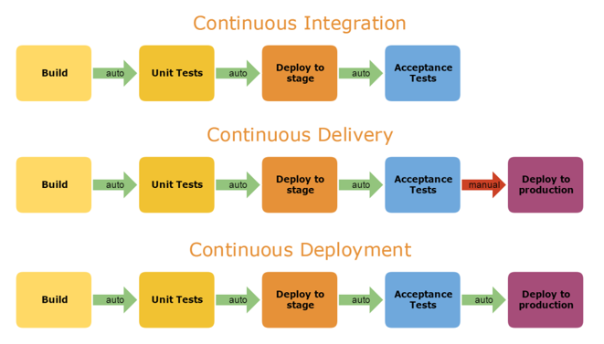
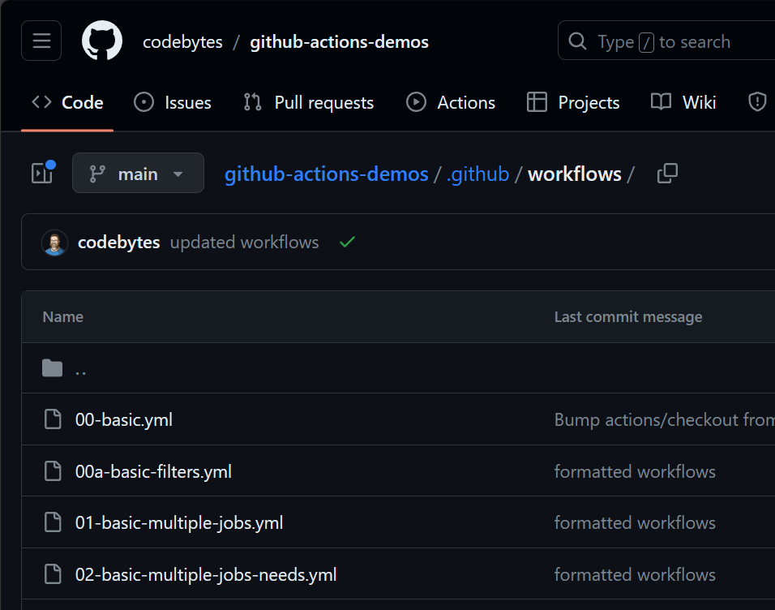
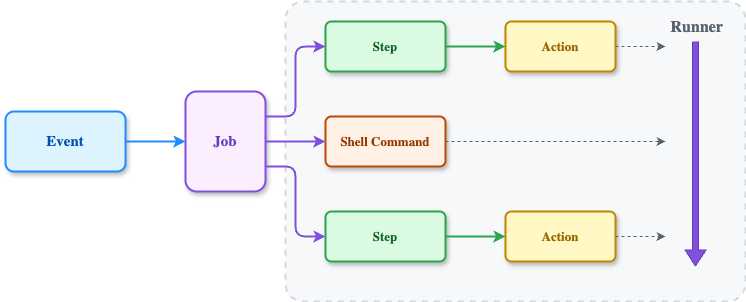
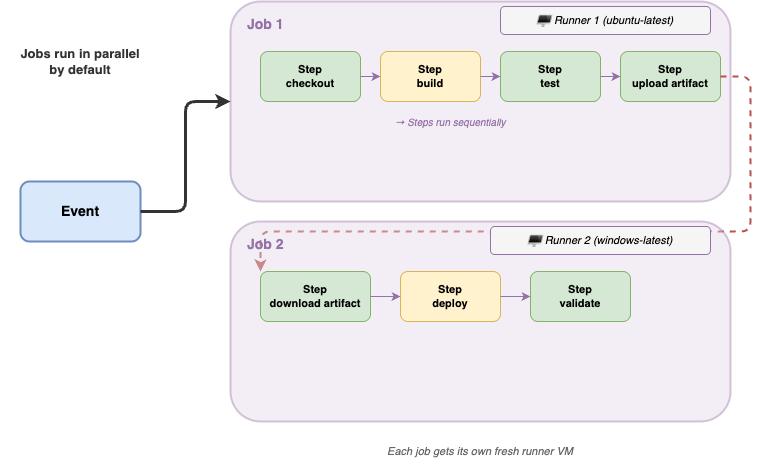

<!-- _footer: 'https://github.com/codebytes/github-actions-demos' -->

# CI/CD with GitHub Actions

## Chris Ayers


---


## Chris Ayers
### Senior Customer Engineer<br>Microsoft

<i class="fa-brands fa-twitter"></i> Twitter: @Chris\_L\_Ayers
<i class="fa-brands fa-mastodon"></i> Mastodon: @Chrisayers@hachyderm.io
<i class="fa-brands fa-linkedin"></i> LinkedIn: - [chris\-l\-ayers](https://linkedin.com/in/chris-l-ayers/)
<i class="fa fa-window-maximize"></i> Blog: [https://chris-ayers\.com/](https://chris-ayers.com/)
<i class="fa-brands fa-github"></i> GitHub: [Codebytes](https://github.com/codebytes)

---


# Agenda
- YAML
- CI / CD
- Actions Overview
- Demos

---

<div class="columns">
<div>

# YAML
## **Yet Another Markup Language**

GitHub uses YAML for workflows

Demo: [Online Parser](https://yaml-online-parser.appspot.com/)

<!-- Zelda:
  type: pit bull
  favoriteThings:
  - treats
  - naps
  - belly rubs
  toys: [bone, doll] -->

</div>
<div>

| Feature   | Description                       |
| --------- | --------------------------------- |
| Lists     | Start with a –                    |
| Key-Value | Key: value                        |
| Objects   | Objects:<br>Properties of objects |

</div>

</div>

---

# Workflows / Pipelines


---

# What is CI/CD?



---


# Actions Overview

- Live in the `.github/workflows` folder
- Workflows are defined in YAML
- Workflows are Event Driven

---

# Events that trigger workflows
[https://docs.github.com/actions/using-workflows/events-that-trigger-workflows](https://docs.github.com/actions/using-workflows/events-that-trigger-workflows)

<div class="columns">
<div>

- branch_protection_rule
- checks
- create
- delete
- deployment
- discussion
- fork
- issue_comment
- issues
- label

</div>
<div>

- page_build
- pull_request
- pull_request_review
- pull_request_review_comment
- push
- release
- schedule
- status
- workflow_call
- workflow_dispatch

</div>
</div>

---



# Workflows
- [Events](https://docs.github.com/en/actions/using-workflows/events-that-trigger-workflows) trigger workflows
- Workflows contain jobs
- Jobs contain steps
- Steps are commands or actions

---


# Jobs
- Workflows can contain multiple jobs
- Jobs run in parallel by default
- Each job runs on a [Runner](https://docs.github.com/en/actions/using-github-hosted-runners/about-github-hosted-runners)
- Steps and Shell Commands run in sequence

---

# Runners

- Specify the type of runner with `runs-on` (e.g., `ubuntu-latest`).
- GitHub provisions a new VM for each job.
- Steps in a job share information using the runner's filesystem.
- VM is decommissioned after job completion.

---

# Supported runners and hardware

- GitHub-hosted runner application is open source.
- OS: Windows, Linux, and macOS
  - Runners include preinstalled software, updated weekly.
  - There are also Large Hosted Runners
- Self-Hosted Runners
- You can install additional software on runners.

---


# DEMOS

---

# ACT
## Run Actions Locally

<i class="fa-brands fa-github"></i>  [nektos/act](https://github.com/nektos/act)


<!-- act -W .github/workflows/02-basic-multiple-jobs-needs.yml -->

---

<!-- _footer: "https://docs.github.com/en/actions/security-guides" -->

# Security


<div class="columns">
<div>

- Never use structured data as a secret
- Register all secrets used within workflows
- Audit how secrets are handled
- Use credentials that are minimally scoped
- Audit and rotate registered secrets
- Consider requiring review for access to secrets

</div>
<div>

- Use an action instead of an inline script (recommended)
- Use an intermediate environment variable
- Use OpenID Connect to access cloud resources
- Pin third-party actions to a full length commit SHA

</div>
</div>

---

# Actions Updates - Dependabot

<div class="columns">
<div>

- Actions are regularly updated for enhanced automation.
- Dependabot keeps GitHub Actions references in workflow.yml up-to-date.
- If newer action versions exist, Dependabot sends an update pull request.
- Dependabot also updates git references for reusable workflows.
</div>
<div>

<br>

`.github/dependabot.yml`
```yaml
version: 2
updates:
  # See documentation for possible values
  - package-ecosystem: "github-actions"
    # Location of package manifests
    directory: "/" 
    schedule:
      interval: "weekly"
```

</div>
</div>

---


# DEMOS

---

# Questions


---

# Resources

<div class="columns">
<div>

## Links

- [https://docs.github.com](https://docs.github.com)
- [https://skills.github.com](https://docs.github.com)
- [codebytes/github-actions-demos](https://github.com/codebytes/github-actions-demos)
- [https://learn.microsoft.com/en-us/training/paths/automate-workflow-github-actions/](https://learn.microsoft.com/en-us/training/paths/automate-workflow-github-actions/)
</div>
<div>

## Follow Chris Ayers

<i class="fa-brands fa-twitter"></i> Twitter: @Chris\_L\_Ayers
<i class="fa-brands fa-mastodon"></i> Mastodon: @Chrisayers@hachyderm.io
<i class="fa-brands fa-linkedin"></i> LinkedIn: - [chris\-l\-ayers](https://linkedin.com/in/chris-l-ayers/)
<i class="fa fa-window-maximize"></i> Blog: [https://chris-ayers\.com/](https://chris-ayers.com/)
<i class="fa-brands fa-github"></i> GitHub: [Codebytes](https://github.com/codebytes)

</div>

</div>

<!-- Needed for mermaid, can be anywhere in file except frontmatter -->
<script type="module">
  import mermaid from 'https://cdn.jsdelivr.net/npm/mermaid@10/dist/mermaid.esm.min.mjs';
  mermaid.initialize({ startOnLoad: true });
</script>
