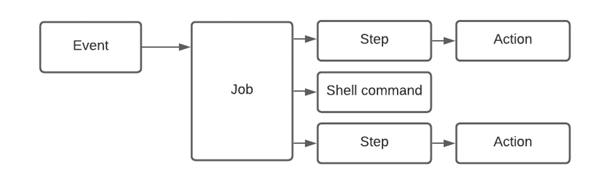
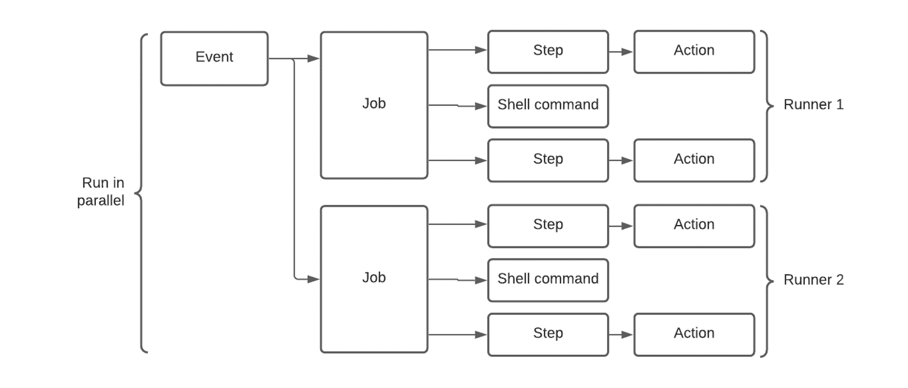

<!-- _footer: 'https://github.com/codebytes/github-actions-demos' -->

# CI/CD with GitHub Actions

---

## Chris Ayers
### Senior Customer Engineer Microsoft

<i class="fa-brands fa-twitter"></i> Twitter: @Chris\_L\_Ayers
<i class="fa-brands fa-mastodon"></i> Mastodon: @Chrisayers@hachyderm.io
<i class="fa-brands fa-linkedin"></i> LinkedIn: - [chris\-l\-ayers](https://linkedin.com/in/chris-l-ayers/)
<i class="fa fa-window-maximize"></i> Blog: [https://chris-ayers\.com/](https://chris-ayers.com/)
<i class="fa-brands fa-github"></i> GitHub: [Codebytes](https://github.com/codebytes)

---

# Agenda
- YAML
- CI / CD
- Actions Overview
- Demos

---

# YAML
## **Yet Another Markup Language**

GitHub uses YAML for workflows

Demo: [Online Parser](https://yaml-online-parser.appspot.com/)

| Feature | Description |
| --- | --- |
| Lists | Start with a – |
| Key-Value | Key: value |
| Objects | Objects: Properties of objects |

---

# What is CI/CD?

---

# Actions Overview

- Actions are Event Driven
- Live in the .github/workflows folder
- Workflows are defined in YAML

---

# Workflows
- [Events](https://docs.github.com/en/actions/using-workflows/events-that-trigger-workflows) trigger workflows
- Workflows contain jobs
- Jobs contain steps
- Steps are commands or actions

---

# Jobs
- Workflows can contain multiple jobs
- Each job runs on a [Runner](https://docs.github.com/en/actions/using-github-hosted-runners/about-github-hosted-runners)

---

# ACT
## Run Actions Locally

<i class="fa-brands fa-github"></i>  [nektos/act](https://github.com/nektos/act)

---

# DEMOS

---

# Questions

---

# Resources

## Links

- [https://docs.github.com](https://docs.github.com)
- [https://skills.github.com](https://docs.github.com)
- [codebytes/github-actions-demos](https://github.com/codebytes/github-actions-demos)

## Follow Chris Ayers 

<i class="fa-brands fa-twitter"></i> Twitter: @Chris\_L\_Ayers
<i class="fa-brands fa-mastodon"></i> Mastodon: @Chrisayers@hachyderm.io
<i class="fa-brands fa-linkedin"></i> LinkedIn: - [chris\-l\-ayers](https://linkedin.com/in/chris-l-ayers/)
<i class="fa fa-window-maximize"></i> Blog: [https://chris-ayers\.com/](https://chris-ayers.com/)
<i class="fa-brands fa-github"></i> GitHub: [Codebytes](https://github.com/codebytes)

