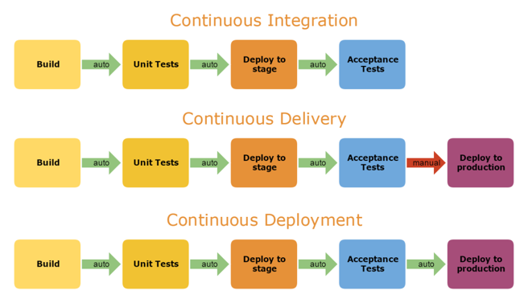
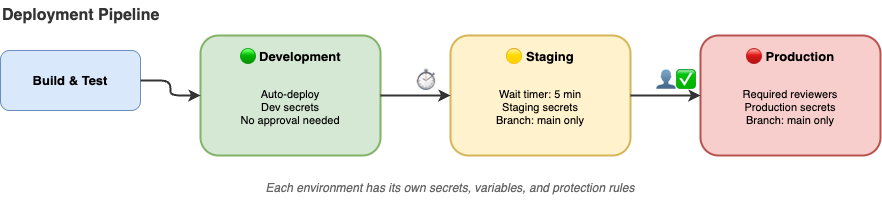
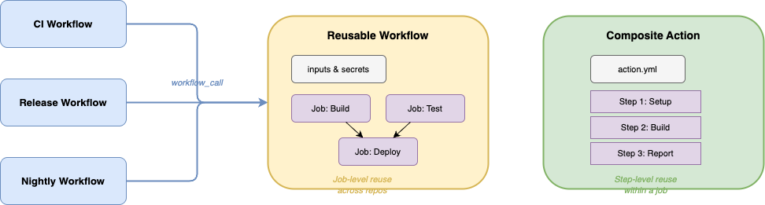
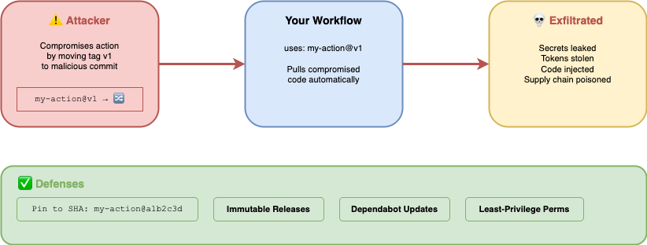
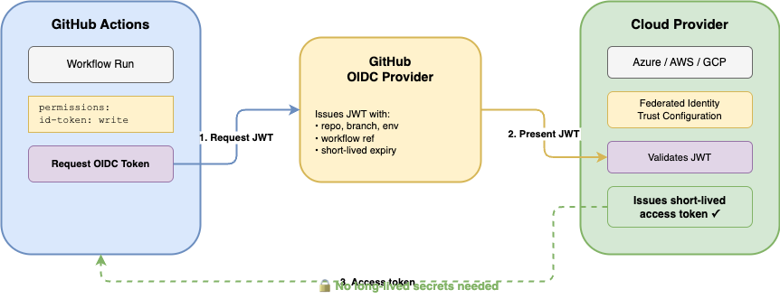
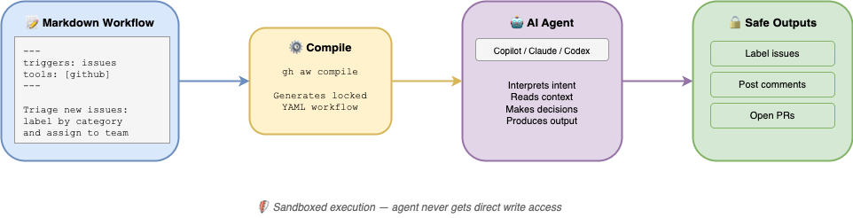

<!-- _footer: 'https://github.com/codebytes/github-actions-demos' -->

# CI/CD with GitHub Actions

## Chris Ayers


---


## Chris Ayers
### Principal Software Engineer<br>Microsoft

<i class="fa-brands fa-bluesky"></i> BlueSky: [@chris-ayers.com](https://bsky.app/profile/chris-ayers.com)
<i class="fa-brands fa-linkedin"></i> LinkedIn: - [chris\-l\-ayers](https://linkedin.com/in/chris-l-ayers/)
<i class="fa fa-window-maximize"></i> Blog: [https://chris-ayers\.com/](https://chris-ayers.com/)
<i class="fa-brands fa-github"></i> GitHub: [Codebytes](https://github.com/codebytes)

---


# Agenda
- YAML & CI/CD
- Actions Overview
- Building Workflows
- Expressions, Contexts & Variables
- Demos
- Security & Supply Chain
- Demos
- The Evolution of CI/CD

---

<div class="columns">
<div>

# YAML
## **Yet Another Markup Language**

GitHub uses YAML for workflows

Demo: [Online Parser](https://yaml-online-parser.appspot.com/)

</div>
<div>

| Feature   | Description                       |
| --------- | --------------------------------- |
| Lists     | Start with a –                    |
| Key-Value | Key: value                        |
| Objects   | Objects:<br>Properties of objects |

</div>

</div>

---

# Workflows / Pipelines


---

# What is CI/CD?



---


# Actions Overview

- Live in the `.github/workflows` folder
- Workflows are defined in YAML
- Workflows are Event Driven

---

# Events that trigger workflows
[https://docs.github.com/actions/using-workflows/events-that-trigger-workflows](https://docs.github.com/actions/using-workflows/events-that-trigger-workflows)

<div class="columns">
<div>

- branch_protection_rule
- checks
- create / delete
- deployment
- discussion
- fork
- issue_comment
- issues
- label
- merge_group

</div>
<div>

- page_build
- pull_request
- pull_request_review
- pull_request_review_comment
- push
- release
- schedule
- schedule (**timezone support** for cron)
- status
- workflow_call / workflow_dispatch

</div>
</div>

---


# Workflows
- [Events](https://docs.github.com/en/actions/using-workflows/events-that-trigger-workflows) trigger workflows
- Workflows contain jobs
- Jobs contain steps
- Steps are commands or actions

---


# Jobs
- Workflows can contain multiple jobs
- Jobs run in parallel by default
- Each job runs on a [Runner](https://docs.github.com/en/actions/using-github-hosted-runners/about-github-hosted-runners)
- Steps and Shell Commands run in sequence

---

# Runners

- Specify the type of runner with `runs-on` (e.g., `ubuntu-latest`).
- GitHub provisions a new VM for each job.
- Steps in a job share information using the runner's filesystem.
- VM is decommissioned after job completion.

---

# Supported runners and hardware

- GitHub-hosted runner application is open source.
- OS: Windows, Linux, and macOS
  - Runners include preinstalled software, updated weekly.
  - Larger runners: more CPU/RAM, GPU, and ARM64 options
  - **Custom images** for org-defined runner environments
- Self-Hosted Runners
  - **Scale Set Client**: autoscale without Kubernetes
- You can install additional software on runners.

---

# Matrix Strategies

- Run jobs across multiple configurations
- Combine OS, language versions, and more
- Use `include`/`exclude` for fine-tuning

```yaml
strategy:
  matrix:
    os: [ubuntu-latest, windows-latest]
    node-version: [18.x, 20.x, 22.x]
  fail-fast: false
```

---

# Caching & Artifacts

<div class="columns">
<div>

## Caching
- Speed up workflows with `actions/cache`
- Cache dependencies (npm, NuGet, pip)
- Key-based with restore keys

</div>
<div>

## Artifacts
- Share data between jobs with `actions/upload-artifact`
- Download in later jobs or after run
- Set retention periods

</div>
</div>

---

# Environments & Deployments



- **Environments** define deployment targets (dev, staging, prod)
- Configure **protection rules**:
  - Required reviewers / approvals
  - Wait timers
  - Branch restrictions
- Environment-specific **secrets and variables**
- Deployment history and status tracking
- Use `deployment: false` for env secrets without creating deployments

---

# Reusable Workflows & Composite Actions



<div class="columns">
<div>

## Reusable Workflows
- Define once, call from many workflows
- Triggered via `workflow_call`
- Accept `inputs` and `secrets`
- Full job-level reuse across repos

</div>
<div>

## Composite Actions
- Bundle multiple steps into one action
- Defined in `action.yml`
- Ideal for shared setup logic
- Step-level reuse within a job

</div>
</div>

---

# Concurrency

- Prevent duplicate workflow runs
- Group by branch, PR, or environment
- Optionally cancel in-progress runs

```yaml
concurrency:
  group: ${{ github.workflow }}-${{ github.ref }}
  cancel-in-progress: true
```

- Essential for deployments and expensive jobs

---

# Conditionals & Expressions

<div class="columns">
<div>

## Conditionals
- Control step execution with `if:`
- Check env vars, contexts, or outputs
- Use `success()`, `failure()`, `always()`

```yaml
- name: Deploy
  if: github.ref == 'refs/heads/main'
  run: ./deploy.sh
```

</div>
<div>

## Expressions
- `${{ }}` syntax for dynamic values
- Functions: `format()`, `contains()`, `join()`
- Parse JSON: `fromJson()`
- String checks: `startsWith()`, `endsWith()`

</div>
</div>

---

# Contexts & Variables

<div class="columns">
<div>

## Contexts
- `github` — event, repo, actor, ref
- `env` — environment variables
- `secrets` — encrypted secrets
- `vars` — configuration variables
- `runner` — runner OS, temp dir
- `steps` — outputs from prior steps
- `job` / `matrix` / `strategy`

</div>
<div>

## Variables vs Secrets
- **Variables** (`vars`): non-sensitive config
  - Visible in logs, reusable across jobs
- **Secrets** (`secrets`): sensitive values
  - Masked in logs, encrypted at rest
- Both configurable at repo, environment, and org level

</div>
</div>

---

# ACT
## Run Actions Locally

<i class="fa-brands fa-github"></i>  [nektos/act](https://github.com/nektos/act)

<i class="fa-brands fa-github"></i>  [SanjulaGanepola/github-local-actions](https://github.com/SanjulaGanepola/github-local-actions)


<!-- act -W .github/workflows/02-basic-multiple-jobs-needs.yml -->

---


# DEMOS
## Basics, Variables, Secrets, Matrix, CI/CD

---

# Workshop repo

### <i class="fa-brands fa-github"></i> [actions-workshop/actions-workshop](https://github.com/actions-workshop/actions-workshop)


---

# Supply Chain Attacks



- Attackers compromise **upstream dependencies** or actions
- Mutable tags (e.g., `v1`) can be moved to malicious commits
- Real-world: `tj-actions/changed-files` (2025)

### Mitigations
- **Pin to full commit SHAs**
- Use **Dependabot** for updates
- Enable **secret scanning**
- Review action source and permissions

---

# Immutable Releases for Actions

- Action publishers can enable **immutable releases** — tags can't be moved or deleted
- Eliminates tag-mutation supply chain attacks
- Consumers should still prefer **full commit SHAs** for maximum assurance
- **Required workflows** can enforce org policy: only immutable refs or SHAs allowed
- Defense-in-depth alongside Dependabot and secret scanning

---

# Workflow Dependency Locking

- **NEW**: Lock all action dependencies to SHAs in workflow YAML
- Similar to `go.sum` or `package-lock.json` — but for actions
- Hash mismatch **fails the workflow** before jobs run
- Dependency changes visible as **PR diffs**

```yaml
dependencies:
  actions/checkout: sha256:a1b2c3d...
  actions/setup-node: sha256:e4f5g6h...
```

---

<!-- _footer: "https://docs.github.com/en/actions/security-guides" -->

# Security Best Practices

<div class="columns">
<div>

- Never use structured data as a secret
- Register all secrets used within workflows
- Audit how secrets are handled
- Use credentials that are minimally scoped
- Audit and rotate registered secrets
- Consider requiring review for access to secrets

</div>
<div>

- Use an action instead of an inline script (recommended)
- Use an intermediate environment variable
- Use OpenID Connect to access cloud resources
- Pin third-party actions to a full length commit SHA
- **Scoped secrets**: restrict by branch, environment, or workflow

</div>
</div>

---

# Permissions

- Workflows have a `GITHUB_TOKEN` with default permissions.
- **Always** restrict to least privilege with `permissions:` block.
- Set at workflow level or per job.

```yaml
permissions:
  contents: read
  pull-requests: write
```

- Default can be set to **read-only** at org/repo level.
- Jobs that need `id-token: write` for OIDC must declare it explicitly.

---

# OpenID Connect (OIDC)



- **Passwordless** authentication to cloud providers
- GitHub issues **short-lived tokens** per workflow run
- No more long-lived cloud credentials as secrets
- Supported: Azure, AWS, GCP, HashiCorp Vault
- **Custom claims**: use repo properties for granular access control

```yaml
- uses: azure/login@v2
  with:
    client-id: ${{ secrets.AZURE_CLIENT_ID }}
    tenant-id: ${{ secrets.AZURE_TENANT_ID }}
    subscription-id: ${{ secrets.AZURE_SUBSCRIPTION_ID }}
```

---

# Artifact Attestations

- **Cryptographically sign** build artifacts with [Sigstore](https://www.sigstore.dev/)
- Records **build provenance**: commit, workflow, environment
- Verify artifacts haven't been tampered with
- Meets compliance and audit requirements

```yaml
- uses: actions/attest-build-provenance@v4
  with:
    subject-path: 'dist/**'
```

---

# Actions Updates - Dependabot

<div class="columns">
<div>

- Actions are regularly updated for enhanced automation.
- Dependabot keeps GitHub Actions references in workflow.yml up-to-date.
- If newer action versions exist, Dependabot sends an update pull request.
- Dependabot also updates git references for reusable workflows.
</div>
<div>

<br>

`.github/dependabot.yml`
```yaml
version: 2
updates:
  - package-ecosystem: "github-actions"
    directory: "/"
    schedule:
      interval: "weekly"
```

</div>
</div>

---


# DEMOS
## Security, Linting, Containers, Deployments

---

# Agentic Workflows



- Define workflows in **Markdown** with natural language
- AI agents (Copilot, Claude, Codex) interpret and execute
- YAML frontmatter for triggers, permissions, toolsets
- Intent-driven, not script-driven

### Use Cases
- Automated issue triage and labeling
- Continuous documentation updates
- CI failure investigation and fix proposals
- Code quality improvements via PR

---

# From CI/CD to Continuous AI

<div class="columns">
<div>

## Traditional CI/CD
- Deterministic YAML pipelines
- Scripted, step-by-step
- Predictable outputs

</div>
<div>

## Continuous AI
- Intent-driven automation
- AI agents make decisions
- Context-aware, adaptive
- Humans review outcomes

</div>
</div>

---

# Bonus - Private Networking & Egress Control

- Runner NIC deploys into your **Azure VNET**
- Access private resources without public endpoints
- **Native Egress Firewall** (coming):
  - Layer 7 firewall **outside** the runner VM
  - Allowlist endpoints per job
  - Blocks data exfiltration even with root access


---

# [GitHub Well-Architected Framework](https://wellarchitected.github.com)


- **Community-driven guide** for deploying GitHub effectively.
- Pillars: Security, Scalability, Automation, Collaboration, Observability, Performance, Governance, Innovation
- Actionable, prescriptive advice

---

# Questions


---

# Resources

<div class="columns">
<div>

## Links

- [https://docs.github.com](https://docs.github.com)
- [https://skills.github.com](https://skills.github.com)
- [codebytes/github-actions-demos](https://github.com/codebytes/github-actions-demos)
- [https://learn.microsoft.com/en-us/training/paths/automate-workflow-github-actions/](https://learn.microsoft.com/en-us/training/paths/automate-workflow-github-actions/)
</div>
<div>

## Follow Chris Ayers

<i class="fa-brands fa-bluesky"></i> BlueSky: [@chris-ayers.com](https://bsky.app/profile/chris-ayers.com)
<i class="fa-brands fa-linkedin"></i> LinkedIn: - [chris\-l\-ayers](https://linkedin.com/in/chris-l-ayers/)
<i class="fa fa-window-maximize"></i> Blog: [https://chris-ayers\.com/](https://chris-ayers.com/)
<i class="fa-brands fa-github"></i> GitHub: [Codebytes](https://github.com/codebytes)

</div>

</div>

---

# Thank you!

## Please connect

