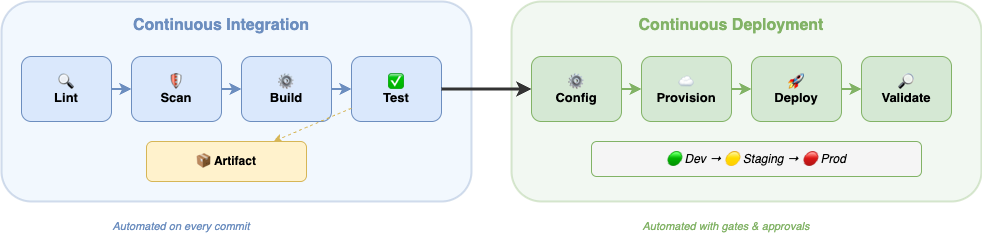
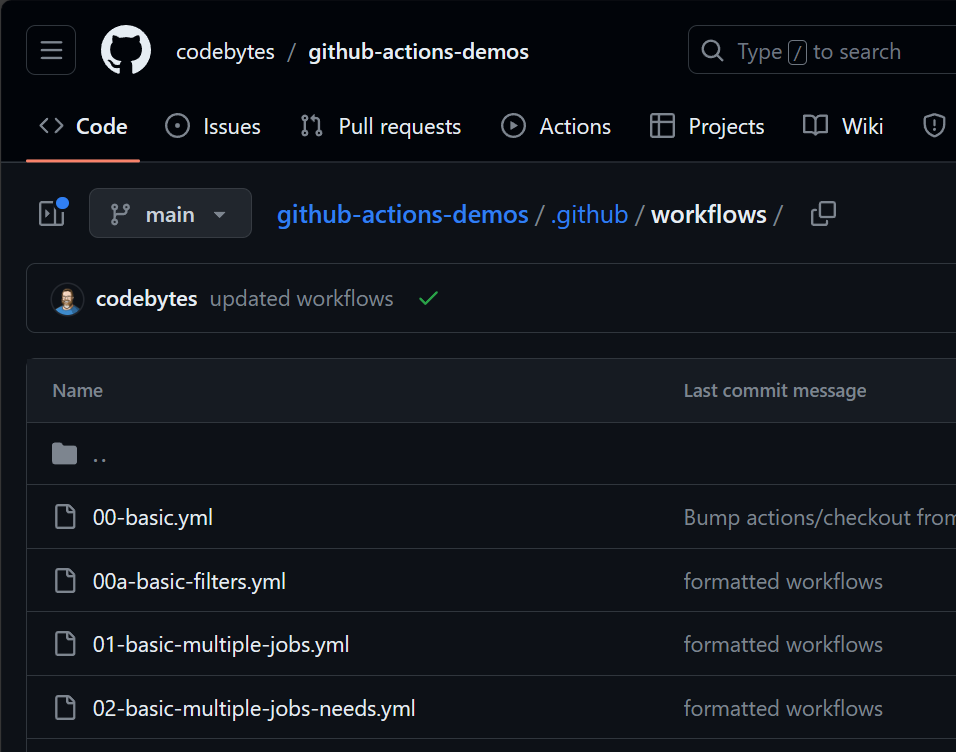
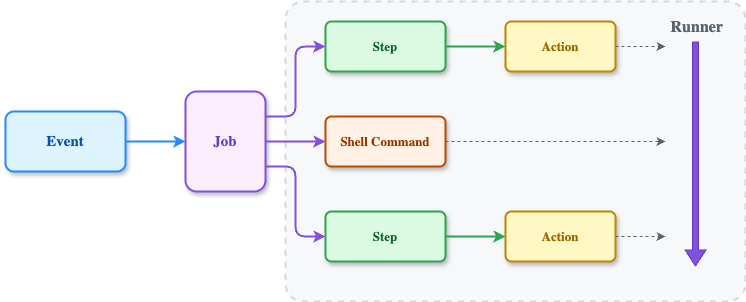
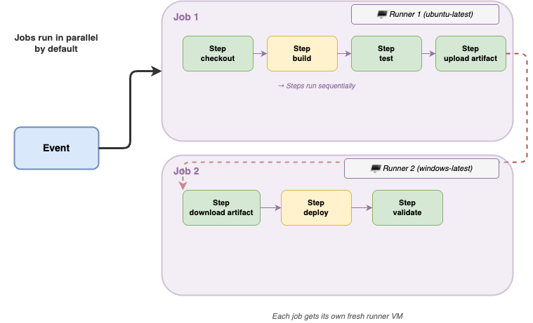
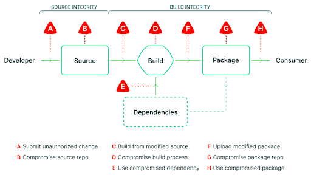
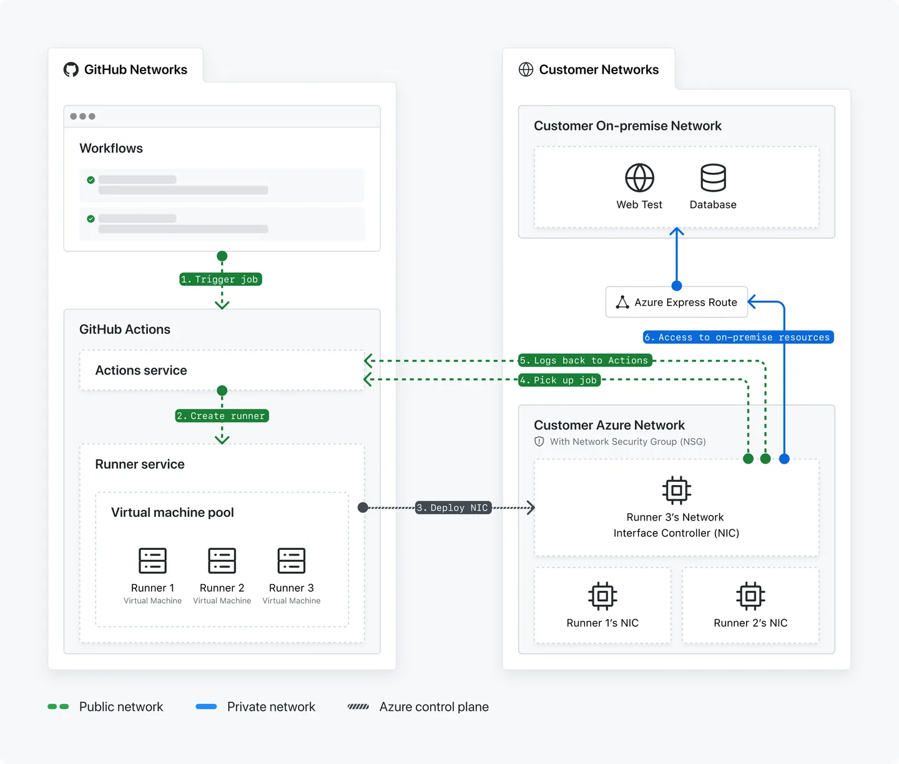
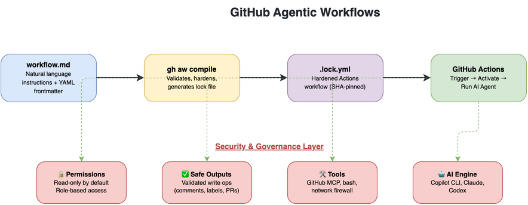

<!-- _footer: 'https://github.com/codebytes/github-actions-demos' -->

# CI/CD with GitHub Actions

## Chris Ayers


---


## Chris Ayers
### Principal Software Engineer<br>Microsoft

<i class="fa-brands fa-bluesky"></i> BlueSky: [@chris-ayers.com](https://bsky.app/profile/chris-ayers.com)
<i class="fa-brands fa-linkedin"></i> LinkedIn: - [chris\-l\-ayers](https://linkedin.com/in/chris-l-ayers/)
<i class="fa fa-window-maximize"></i> Blog: [https://chris-ayers\.com/](https://chris-ayers.com/)
<i class="fa-brands fa-github"></i> GitHub: [Codebytes](https://github.com/codebytes)
<i class="fa-brands fa-mastodon"></i> Mastodon: @Chrisayers@hachyderm.io
~~<i class="fa-brands fa-twitter"></i> Twitter: @Chris_L_Ayers~~

---

<div class="columns">
<div>

# YAML
## **Yet Another Markup Language**

GitHub uses YAML for workflows

Demo: [Online Parser](https://yaml-online-parser.appspot.com/)

<!-- Zelda:
  type: pit bull
  favoriteThings:
  - treats
  - naps
  - belly rubs
  toys: [bone, doll] -->

</div>
<div>

| Feature   | Description                       |
| --------- | --------------------------------- |
| Lists     | Start with a –                    |
| Key-Value | Key: value                        |
| Objects   | Objects:<br>Properties of objects |

</div>

</div>

---

<!-- _class: lead -->

# Workflows & Pipelines

<div class="text-muted" style="font-size: 0.8em; margin-bottom: 1em;">
From code commit to production deployment
</div>



---


# Actions Overview

- Live in the `.github/workflows` folder
- Workflows are defined in YAML
- Workflows are Event Driven

---

# Workflow Syntax

<style scoped>
pre { font-size: 72%; }
</style>

<div class="columns">
<div>

```yaml
name: CI Pipeline
on:
  push:
    branches: [main]
  pull_request:
    branches: [main]
  workflow_dispatch:
```

</div>
<div>

```yaml
jobs:
  build:
    runs-on: ubuntu-latest
    steps:
      - uses: actions/checkout@v4
      - name: Run tests
        run: npm test
      - name: Build
        run: npm run build
```

</div>
</div>

---

# Events that trigger workflows

<style scoped>
li { font-size: 84%; margin: 0.15em 0; line-height: 1.3; }
a { font-size: 90%; }
</style>

[Events docs](https://docs.github.com/actions/using-workflows/events-that-trigger-workflows)

<div class="columns">
<div>

- branch_protection_rule
- checks
- create / delete
- deployment
- discussion
- fork
- issue_comment
- issues
- label

</div>
<div>

- page_build
- pull_request
- pull_request_review
- pull_request_review_comment
- push
- release
- schedule / status
- workflow_call / workflow_dispatch

</div>
</div>

---



# Workflows
- [Events](https://docs.github.com/en/actions/using-workflows/events-that-trigger-workflows) trigger workflows
- Workflows contain jobs
- Jobs contain steps
- Steps are commands or actions

---


# Jobs
- Workflows can contain multiple jobs
- Jobs run in parallel by default
- Each job runs on a [Runner](https://docs.github.com/en/actions/using-github-hosted-runners/about-github-hosted-runners)
- Steps and Shell Commands run in sequence

---

# Steps

<style scoped>
pre { font-size: 66%; line-height: 1.3; }
h3 { margin-bottom: 0.15em; }
</style>

<div class="columns">
<div>

### `run:` — Shell commands
```yaml
steps:
  - name: Single line
    run: echo "Hello"

  - name: Multi-line
    run: |
      echo "Building..."
      npm ci
      npm run build

  - name: Use a different shell
    run: Get-Process
    shell: pwsh
```

</div>
<div>

### `uses:` — Actions
```yaml
steps:
  - uses: actions/checkout@v4

  - uses: actions/setup-node@v4
    with:
      node-version: 20
      cache: 'npm'

  - name: Step with output
    id: version
    run: echo "tag=v1.0" >>
         $GITHUB_OUTPUT

  - run: echo ${{ steps.version
         .outputs.tag }}
```

</div>
</div>

---

# Job Dependencies & Outputs

<style scoped>
pre { font-size: 66%; line-height: 1.3; }
h3 { margin-bottom: 0.2em; }
</style>

<div class="columns">
<div>

### `needs:` — Sequencing jobs
```yaml
jobs:
  build:
    runs-on: ubuntu-latest
    steps: [...]

  test:
    needs: build  # waits for build
    runs-on: ubuntu-latest
    steps: [...]

  deploy:
    needs: [build, test]
    runs-on: ubuntu-latest
```

</div>
<div>

### Passing data between jobs
```yaml
jobs:
  version:
    outputs:
      tag: ${{ steps.v.outputs.tag }}
    steps:
      - id: v
        run: echo "tag=v1.2.3" >>
             $GITHUB_OUTPUT
  deploy:
    needs: version
    steps:
      - run: echo ${{ needs
             .version.outputs.tag }}
```

</div>
</div>

---

# Runners

- Specify the type of runner with `runs-on` (e.g., `ubuntu-latest`).
- GitHub provisions a new VM for each job.
- Steps in a job share information using the runner's filesystem.
- VM is decommissioned after job completion.

---

# Supported runners and hardware

- GitHub-hosted runner application is open source.
- 🪟 **Windows** · 🐧 **Linux** · 🍎 **macOS**
  - Runners include preinstalled software, updated weekly.
  - There are also Large Hosted Runners
- 🏠 Self-Hosted Runners
- You can install additional software on runners.

---

# Environment Variables & Contexts

<div class="columns">
<div>

**Scoping**: workflow → job → step

```yaml
env:
  APP_ENV: production
jobs:
  build:
    env:
      NODE_ENV: test
    steps:
      - run: echo $APP_ENV
        env:
          LOG_LEVEL: debug
```

</div>
<div>

**Contexts** provide runtime info

| Context | Example |
|---------|---------|
| `github.*` | `github.sha`, `github.ref` |
| `env.*` | `env.APP_ENV` |
| `secrets.*` | `secrets.API_KEY` |
| `runner.*` | `runner.os` |
| `matrix.*` | `matrix.node-version` |

</div>
</div>

---

# Path Filters & Concurrency

<div class="columns">
<div>

### 📂 Path Filters — Monorepo support
```yaml
on:
  push:
    paths:
      - 'src/**'
      - 'package.json'
    paths-ignore:
      - 'docs/**'
      - '*.md'
```

Only triggers when relevant files change

</div>
<div>

### 🔁 Concurrency — Avoid duplicate runs
```yaml
concurrency:
  group: ${{ github.workflow }}-
    ${{ github.ref }}
  cancel-in-progress: true
```

✅ Cancels stale PR runs
✅ Saves runner minutes
✅ Ensures only latest commit deploys

</div>
</div>

---

# Expressions & Conditionals

<style scoped>
pre { font-size: 68%; line-height: 1.35; }
h3 { margin-bottom: 0.2em; }
table { font-size: 78%; }
</style>

<div class="columns">
<div>

### Expressions `${{ }}`

```yaml
steps:
  - name: Greet
    run: echo "SHA is ${{ github.sha }}"

  - name: Only on main
    if: github.ref == 'refs/heads/main'
    run: echo "Deploying..."

  - name: Skip on fork
    if: github.event.pull_request.head
        .repo.fork == false
    run: npm run deploy
```

</div>
<div>

### Common Functions

| Function | Use |
|----------|-----|
| `contains()` | Check strings/arrays |
| `startsWith()` | Branch matching |
| `format()` | String templates |
| `toJSON()` | Debug contexts |
| `success()` | Previous step OK |
| `failure()` | Previous step failed |
| `always()` | Run regardless |

</div>
</div>

---

# Matrix Strategies

<style scoped>
pre { font-size: 68%; line-height: 1.3; }
p { font-size: 88%; margin: 0.2em 0; }
h1 { margin-bottom: 0.2em; }
</style>

Test across multiple configurations simultaneously

```yaml
jobs:
  test:
    strategy:
      matrix:
        os: [ubuntu-latest, windows-latest, macos-latest]
        node-version: [18, 20, 22]
    runs-on: ${{ matrix.os }}
    steps:
      - uses: actions/checkout@v4
      - uses: actions/setup-node@v4
        with:
          node-version: ${{ matrix.node-version }}
      - run: npm test
```

🎯 Creates **9 parallel jobs** (3 OS × 3 versions)

---

# Secrets & Permissions

<div class="columns">
<div>

### Using Secrets
```yaml
steps:
  - name: Deploy
    env:
      TOKEN: ${{ secrets.DEPLOY_TOKEN }}
    run: ./deploy.sh
```

⚠️ Never `echo` secrets in logs
⚠️ Never use structured data as a secret

</div>
<div>

### GITHUB_TOKEN Permissions
```yaml
permissions:
  contents: read
  pull-requests: write
  packages: write
```

🔐 Always use **least-privilege**
Default token is scoped per-repo

</div>
</div>

---

# Real-World Pipeline — .NET CI/CD

<style scoped>
pre { font-size: 56%; line-height: 1.2; }
li { font-size: 82%; margin: 0.1em 0; }
h3 { margin-bottom: 0.1em; }
</style>

<div class="columns">
<div>

### Build, Test & Publish
```yaml
jobs:
  build:
    runs-on: ubuntu-latest
    steps:
      - uses: actions/checkout@v4
      - uses: actions/setup-dotnet@v4
        with:
          dotnet-version: '10.0.x'
      - run: dotnet restore
      - run: dotnet build -c Release
      - run: dotnet test -c Release
      - run: dotnet publish -c Release
             -o ./webapp
      - uses: actions/upload-artifact@v4
        with:
          name: webapp
          path: ./webapp
```

</div>
<div>

### Deploy to Azure
```yaml
  deploy:
    needs: build
    runs-on: ubuntu-latest
    environment:
      name: production
      url: https://myapp.azurewebsites.net
    steps:
      - uses: azure/login@v2
        with:
          client-id: ${{ secrets.
            AZURE_CLIENT_ID }}
          tenant-id: ${{ secrets.
            AZURE_TENANT_ID }}
      - uses: actions/download-artifact@v4
        with:
          name: webapp
      - uses: azure/webapps-deploy@v3
        with:
          app-name: myapp
```

📂 Demo: `10-dotnet.yml`

</div>
</div>

---

# Artifacts & Caching

<style scoped>
pre { font-size: 68%; line-height: 1.3; }
h3 { margin-bottom: 0.2em; }
p { font-size: 88%; margin: 0.2em 0; }
</style>

<div class="columns">
<div>

### 📦 Artifacts — Share between jobs
```yaml
- uses: actions/upload-artifact@v4
  with:
    name: build-output
    path: dist/

# In another job:
- uses: actions/download-artifact@v4
  with:
    name: build-output
```

</div>
<div>

### ⚡ Caching — Speed up builds
```yaml
- uses: actions/setup-node@v4
  with:
    node-version: 20
    cache: 'npm'
```

Or manual cache control:
```yaml
- uses: actions/cache@v4
  with:
    path: ~/.npm
    key: ${{ runner.os }}-npm-
         ${{ hashFiles('**/
         package-lock.json') }}
```

</div>
</div>

---


# DEMOS
## Workflow Basics

---

# ACT
## Run Actions Locally

<i class="fa-brands fa-github"></i>  [nektos/act](https://github.com/nektos/act)

<i class="fa-brands fa-github"></i>  [SanjulaGanepola/github-local-actions](https://github.com/SanjulaGanepola/github-local-actions)


<!-- act -W .github/workflows/02-basic-multiple-jobs-needs.yml -->

---

# Reusable Workflows & Composite Actions

<style scoped>
pre { font-size: 54%; line-height: 1.15; }
h3 { margin-bottom: 0.1em; }
p { font-size: 78%; margin: 0.1em 0; }
h1 { font-size: 1.6em; margin-bottom: 0.1em; }
</style>

<div class="columns">
<div>

### 🔄 Reusable Workflows
```yaml
# .github/workflows/ci.yml
on:
  workflow_call:
    inputs:
      environment:
        type: string
        required: true
```

Called from another workflow:
```yaml
jobs:
  deploy:
    uses: ./.github/workflows/ci.yml
    with:
      environment: staging
```

</div>
<div>

### 🧩 Composite Actions
```yaml
# .github/actions/setup/action.yml
name: 'Project Setup'
runs:
  using: 'composite'
  steps:
    - uses: actions/setup-node@v4
      with:
        node-version: 20
        cache: 'npm'
    - run: npm ci
      shell: bash
```

Used in workflows:
```yaml
- uses: ./.github/actions/setup
```

</div>
</div>

---

## Composite Actions vs Reusable Workflows

<style scoped>
li { font-size: 80%; margin: 0.15em 0; line-height: 1.3; }
th, td { font-size: 75%; padding: 6px 10px; }
h2 { font-size: 1.5em; margin-bottom: 0.3em; }
</style>

| | 🧩 Composite Action | 🔄 Reusable Workflow |
|---|---|---|
| **Scope** | Runs as a **step** inside a job | Runs as an entire **job** (or jobs) |
| **Location** | `action.yml` in any directory | Must be in `.github/workflows/` |
| **Sharing** | Can publish to Marketplace | Shared via `workflow_call` trigger |
| **Secrets** | Inherits caller's context | Must be passed explicitly (or `inherit`) |
| **Runners** | Uses the **caller's** runner | Can specify its **own** runner |
| **Outputs** | Step-level outputs | Job-level outputs |

<div class="columns">
<div>

**✅ Use Composite Actions for:**
- Bundling related steps (setup, lint)
- Reusable across many workflows
- Publishing to the Marketplace

</div>
<div>

**✅ Use Reusable Workflows for:**
- Complete CI/CD pipelines
- Multi-job orchestration
- Enforcing org-wide standards

</div>
</div>

---

# Environments & Deployment

<style scoped>
pre { font-size: 64%; line-height: 1.25; }
h3 { margin-bottom: 0.15em; }
li { font-size: 88%; margin: 0.1em 0; }
p { font-size: 85%; margin: 0.15em 0; }
</style>

<div class="columns">
<div>

### 🌍 Environments
- **Protection rules** — require approvals
- **Wait timers** — delay before deploy
- **Branch restrictions** — only `main` → prod
- **Environment secrets** — scoped per env

```yaml
jobs:
  deploy-prod:
    environment:
      name: production
      url: https://myapp.com
    runs-on: ubuntu-latest
```

</div>
<div>

### 🔑 OIDC for Cloud Auth
No stored secrets — federated identity

```yaml
permissions:
  id-token: write
  contents: read

steps:
  - uses: azure/login@v2
    with:
      client-id: ${{ secrets.
        AZURE_CLIENT_ID }}
      tenant-id: ${{ secrets.
        AZURE_TENANT_ID }}
      subscription-id: ${{ secrets.
        AZURE_SUBSCRIPTION_ID }}
```

</div>
</div>

---

# Supply Chain Attacks



---

<!-- _footer: "https://docs.github.com/en/actions/security-guides" -->

# 🛡️ Security

<div class="columns">
<div>

- Never use structured data as a secret
- Register all secrets used within workflows
- Audit how secrets are handled
- Use credentials that are minimally scoped
- Audit and rotate registered secrets
- Consider requiring review for access to secrets

</div>
<div>

- Use an action instead of an inline script (recommended)
- Use an intermediate environment variable
- Use OpenID Connect to access cloud resources
- Pin third-party actions to a full length commit SHA

</div>
</div>

---

# Actions Updates - Dependabot

<div class="columns">
<div>

- Actions are regularly updated for enhanced automation.
- Dependabot keeps GitHub Actions references in workflow.yml up-to-date.
- If newer action versions exist, Dependabot sends an update pull request.
- Dependabot also updates git references for reusable workflows.
</div>
<div>

<br>

`.github/dependabot.yml`
```yaml
version: 2
updates:
  # See documentation for possible values
  - package-ecosystem: "github-actions"
    # Location of package manifests
    directory: "/" 
    schedule:
      interval: "weekly"
```

</div>
</div>

---


# DEMOS
## Security & Deployment

---

# Bonus - Private Networking

- GitHub Actions triggers, creating a runner.
- Runner service deploys the runner's NIC into your Azure VNET.
- The runner agent picks up the workflow job.
- Runner sends logs back; NIC accesses private resources.



---

# [GitHub Well-Architected Framework](https://wellarchitected.github.com)


- **Community-driven guide** for deploying GitHub effectively.
- Design principles
- Framework pillars
- Actionable, prescriptive advice

---

# GitHub Well-Architected Framework

## Key Principles of the Framework

<div class="columns"> 
<div>

- 🔐 Security
- 📈 Scalability
- ⚙️ Automation
- 🤝 Collaboration

</div>

<div>

- 👁️ Observability
- 🚀 Performance
- 🏛️ Governance
- 💡 Innovation

</div>
</div>

---

<!-- _class: lead -->

# 🤖 Agentic Workflows

<div class="text-muted" style="font-size: 0.8em; margin-bottom: 1em;">
AI-powered automation with natural language
</div>

---

## What are Agentic Workflows?

<div class="columns">
<div>

- **AI-powered** GitHub Actions
- Write automation in **markdown**
- Agents **understand context**, make decisions, and act
- Compiled to hardened `.lock.yml` files

</div>
<div>

### Traditional vs Agentic

| Traditional | Agentic |
|---|---|
| Fixed if-then rules | Natural language |
| Explicit scripting | Context-aware AI |
| Brittle to change | Adapts flexibly |

</div>
</div>

---

## How It Works



---

## Workflow Structure

<style scoped>
pre { font-size: 60%; line-height: 1.25; }
h3 { margin-bottom: 0.1em; }
</style>

<div class="columns">
<div>

### Frontmatter (YAML config)
```yaml
---
on:
  issues:
    types: [opened]
permissions: read-all
tools:
  github:
    toolsets: [issues, labels]
safe-outputs:
  add-comment:
  add-labels:
    allowed: [bug, feature, question]
---
```

</div>
<div>

### Body (natural language instructions)
```markdown
# Issue Triage Agent

Analyze new issues and categorize
them with the appropriate label.

Skip issues that:
- Already have labels
- Have been assigned to a user

After adding a label, comment
mentioning the author with your
reasoning.
```

📝 The AI agent reads and executes
these instructions at runtime

</div>
</div>

---

## Key Security Features

<style scoped>
li { font-size: 80%; margin: 0.1em 0; line-height: 1.3; }
h3 { margin-bottom: 0.1em; font-size: 1.1em; }
h2 { margin-bottom: 0.2em; }
</style>

<div class="columns">
<div>

### 🔒 Permissions
- **Read-only** by default
- Role-based access (`roles:`)
- `strict: true` enforced

### ✅ Safe Outputs
- Validated write operations
- Scoped to specific actions

</div>
<div>

### 🛡️ Lockdown Mode
- Custom token required
- Integrity filtering
- Bot & role filtering

### 🛠️ Tooling
- `gh aw compile` — Build & validate
- `gh aw audit` — Analyze runs
- `gh aw secrets` — Manage tokens

</div>
</div>

---

## Example: Issue Triage Agent

<div class="columns">
<div>

**What it does:**
- Lists unlabeled issues
- Analyzes title & body with AI
- Adds appropriate labels
- Comments with reasoning

**Triggers:**
- Schedule (weekday afternoons)
- Manual dispatch

</div>
<div>

**Safe outputs:**
- `add-labels` (scoped allowlist)
- `add-comment`

**Security:**
- `strict: true`
- `lockdown: true`
- Role-based access

</div>
</div>

---

# Questions


---

# Resources

<div class="columns">
<div>

## Links

- [https://docs.github.com](https://docs.github.com)
- [https://skills.github.com](https://skills.github.com)
- [codebytes/github-actions-demos](https://github.com/codebytes/github-actions-demos)
- [Agentic Workflows Docs](https://github.github.com/gh-aw/)
- [Agentics Collection](https://github.com/githubnext/agentics)
- [Learn: Automate with Actions](https://learn.microsoft.com/en-us/training/paths/automate-workflow-github-actions/)
</div>
<div>

## Follow Chris Ayers

<i class="fa-brands fa-bluesky"></i> BlueSky: [@chris-ayers.com](https://bsky.app/profile/chris-ayers.com)
<i class="fa-brands fa-linkedin"></i> LinkedIn: - [chris\-l\-ayers](https://linkedin.com/in/chris-l-ayers/)
<i class="fa fa-window-maximize"></i> Blog: [https://chris-ayers\.com/](https://chris-ayers.com/)
<i class="fa-brands fa-github"></i> GitHub: [Codebytes](https://github.com/codebytes)
<i class="fa-brands fa-mastodon"></i> Mastodon: @Chrisayers@hachyderm.io
~~<i class="fa-brands fa-twitter"></i> Twitter: @Chris_L_Ayers~~

</div>

</div>

<!-- Needed for mermaid, can be anywhere in file except frontmatter -->
<script type="module">
  import mermaid from 'https://cdn.jsdelivr.net/npm/mermaid@10/dist/mermaid.esm.min.mjs';
  mermaid.initialize({ startOnLoad: true });
</script>

---

# Thank you!

## Please connect

